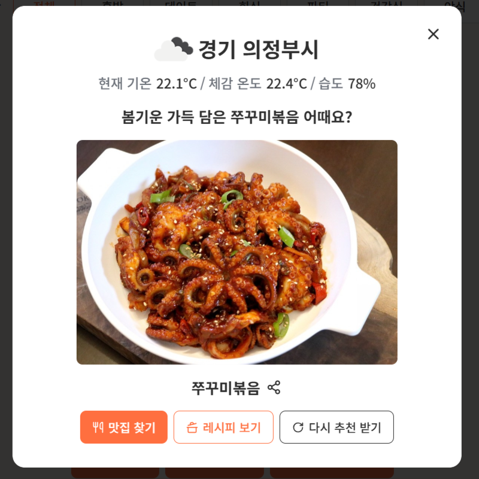

<div align="center">

# JSIX - 룰렛돌리기

### "오늘의 메뉴추천 룰렛"

</div>

## 프로젝트 개요

- **오늘의 메뉴 추천 룰렛**은 점심 메뉴 선택을 쉽고 재미있게 도와주는 웹 애플리케이션입니다.
- **카테고리**별과 **상황**별로 다양한 메뉴를 룰렛으로 돌려 추천받을 수 있으며, **날씨와 계절**에 따라 어울리는 음식도 추천해줍니다.

## 프로젝트 플로우차트

  

## 프로젝트 구조

```
JS-06-JSIX/
├──📁 public/
│ └──📁 assets/
│ ├── 📁 icon/
│ └── 📁 img/

├── src/ # 소스 코드
│ ├── 📁 components/
│ │ ├── ButtonManager.ts
│ │ ├── LinkShare.ts
│ │ ├── MenuHistory.ts
│ │ ├── MenuManager.ts
│ │ ├── Modal.ts
│ │ ├── RouletteWheel.ts
│ │ └── WeatherFoodRecommender.ts

│ ├── 📁 data/
│ │ └── menuList.ts

│ ├── 📁 styles/
│ │ ├── custom.css
│ │ ├── global.css
│ │ ├── homePage.css
│ │ └── reset.css

│ └── main.ts

├── README.md
├── index.html
├── .env
├── .gitignore
├── vite.config.js
├── tsconfig.json
├── package.json
├── package-lock.json
└── 기타 설정 파일들 (.prettier, .eslintrc 등)
```

## 주요기능 미리보기

### 1. 카테고리별 메뉴 불러오기 🍱

- **종류**: 한식, 중식, 일식 등 미리 정의된 음식 종류에서 선택할 수 있습니다.
- **상황**: 혼밥, 데이트, 회식 등 다양한 식사 상황에 맞춰 메뉴를 필터링할 수 있습니다.
- 선택된 종류와 상황 조합에 따라 해당 카테고리에서 무작위로 8개의 메뉴를 자동으로 추천합니다.
- 사용자가 원하는 메뉴를 임의로 정할 수도 있습니다.

<details>
<summary><b>카테고리, 상황별 필터 UI</b></summary>

  
  

</details>

### 2. 룰렛 돌리기 🎯

- **룰렛 돌리기** 버튼을 누르면 미리정해진 리스트 중 메뉴 하나를 선택합니다.
- 선택된 메뉴는 모달로 결과와 함께 이미지로 출력
- **맛집찾기**, **레시피보기** 버튼으로 음식 메뉴에 대한 맛집과 레시피를 검색할 수 있습니다.

<details>
<summary><b>룰렛돌리기, 모달 UI </b></summary>
  
  
</details>

### 3. 메뉴 섞기 / 메뉴 추가 / 초기화 🔄➕🧹

- 메뉴 섞기 버튼을 누르면 메뉴리스트가 랜덤으로 새롭게 짜여집니다 .
- 메뉴 추가로 최대 20개의 메뉴추가 가능.
- 초기화 버튼으로 현재 메뉴의 입력값을 비울 수 있습니다.

<details>
<summary><b>메뉴 섞기, 추가, 초기화 UI</b></summary>
  
  
</details>

### 4. 날씨 기반 추천 🌦️

- **위치 기반 날씨 데이터**를 받아, 현재 지역의 날씨와 맞는 음식메뉴를 추천합니다.
- **맛집찾기**, **레시피보기** 버튼으로 음식 메뉴에 대한 맛집과 레시피를 검색할 수 있습니다.

<details>
<summary><b>날씨 기반 추천 UI</b></summary>
    
</details>

### 5. 최근 뽑힌 메뉴 기록 🕘

- **최근 선택된 메뉴** 5개를 저장 및 표시합니다.
<details>
<summary><b>최근 뽑힌 메뉴 기록 UI</b></summary>
  
</details>

## 사용 기술 및 협업 도구

  <table>
    <tr>
      <th>분류</th>
      <th>툴</th>
    </tr>
    <tr>
      <td><strong>언어 / 스타일</strong></td>
      <td>
        
        
        
        
      </td>
    </tr>
    <tr>
      <td><strong>개발 환경</strong></td>
      <td>
        
        
        
      </td>
    </tr>
    <tr>
      <td><strong>API</strong></td>
      <td>
        
        
      </td>
    </tr>
    <tr>
      <td><strong>협업 / 배포</strong></td>
      <td>
        
        
        
        
        
      </td>
    </tr>
  </table>

## JSIX 구성원

<table>
  <tr>
    <td align="center"></td>
    <td align="center"></td>
    <td align="center"></td>
    <td align="center"></td>
  </tr>
  <tr>
    <td align="center"><strong>팀장</strong></td>
    <td align="center"><strong>팀원</strong></td>
    <td align="center"><strong>팀원</strong></td>
    <td align="center"><strong>팀원</strong></td>
  </tr>
  <tr>
    <td align="center">배희정</td>
    <td align="center">엄현욱</td>
    <td align="center">조한솔</td>
    <td align="center">차형주</td>
  </tr>
  <tr>
    <td align="center">
      <a href="https://github.com/hjb0304"></a>
    </td>
    <td align="center">
      <a href="https://github.com/noognoog"></a>
    </td>
    <td align="center">
      <a href="https://github.com/hansol65"></a>
    </td>
    <td align="center">
       <a href="https://github.com/HyungJuCha"></a>
    </td>
  </tr>
</table>

## 💭 프로젝트 소감

  <table>
    <tr>
      <td width="60" align="center">희정</td>
      <td>프로젝트 조장을 맡아 잘 이끌어나갈 수 있을지 걱정도 되었지만, 실력 좋은 팀원 분들을 만나 무사히 프로젝트를 마칠 수 있었습니다. 수업 시간에 배웠던 것들을 실전에서 활용해보면서 좀 더 확실하게 익힐 수 있었던 것 같아 뿌듯합니다. 앞으로 더 열심히 공부해 보다 완성도 있는 프로젝트를 만들어보고 싶습니다! 다들 고생 많으셨습니다 😎</td>
    </tr>
    <tr>
      <td align="center">현욱</td>
      <td>좋은 팀원분들과 함께 수업때 배운 JS/TS 활용해서 재밌는 프로젝트 무사히 끝마칠 수 있어서 좋았습니다. 확실히 프로젝트로 결과물을 만들어보니 공부한 내용 이해가 더 잘됐던 것 같습니다. 모두 고생하셨습니다! 부트캠프 기간 동안 앞으로 뭐 먹을지 고민될 땐 저희 팀 룰렛을 찾아주세요!</td>
    </tr>
    <tr>
      <td align="center">한솔</td>
      <td>프로젝트가 너무 매끄럽게 진행되어서 신기할 따름이었습니다. 저번 프로젝트가 끝나고 다음 프로젝트가 기대되었는데 기대이상으로 만족스러운 결과가 나와서 좋았습니다. 좋은 팀원분들 만나서 잘 마무리할 수 있었고 너무 고생많으셨습니다!</td>
    </tr>
    <tr>
      <td align="center">형주</td>
      <td>좋은 팀원분들 덕에 성공적인 프로젝트가 될 수 있었습니다. 배운 내용을 직접 써보니 더 깊게 익힐 수 있었고 모르는 부분 또한 스스로 찾아나가며 오랜만에 공부하는 기분을 다시 느낄 수 있었습니다. 부족한 저를 잘 이끌어주시고 챙겨주셔서 정말 감사하고 다들 고생많으셨습니다.</td>
    </tr>
  </table>

---

<div align="center">

### 🍽️ 오늘의 메뉴 추천 룰렛

**© 2025. 맛집의사자처럼 프로젝트 팀 JSIX**

[📂 GitHub 저장소 바로가기](https://github.com/FRONTENDBOOTCAMP-13th/JS-06-JSIX)

[📌 Notion 팀 페이지 바로가기](https://www.notion.so/6-JSIX-1ed73873401a80f88945f0381bb42bd6)

[🌐 배포 사이트 바로가기](https://menuroulett6.netlify.app/)
<br/>

**즐거운 식사시간 되세요!**  
**Happy Coding & Happy Lunch 🍽️**

---

</div>
